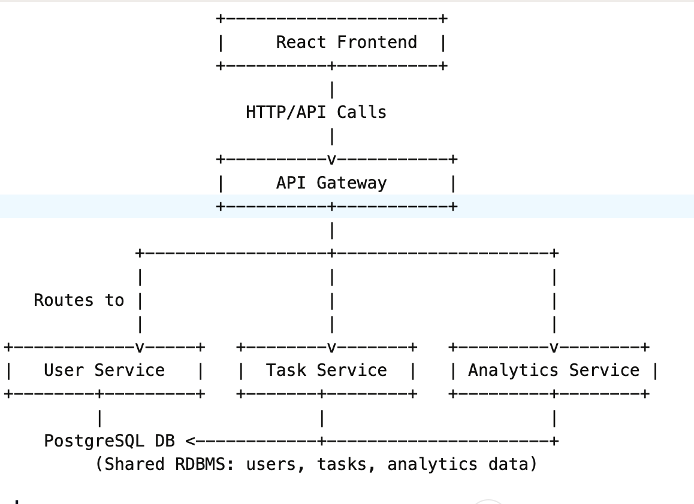

# To-Do Microservices Platform

To-Do Microservices Platform
A modern, scalable to-do management system built with Java, Spring Boot, React, PostgreSQL, and Docker.
This project demonstrates microservices architecture best practices with a clean separation of concerns, JWT security, API Gateway, service-to-service communication, and multi-user support.

Architecture Overview


### API Gateway (api-gateway/)

- **Purpose**: Single entry point for all client requests; routes to the appropriate backend service based on path.
- **Technology**: Spring Cloud Gateway.
- **Exposed Port**: 8080
- **Security**: No direct authentication logic—instead, backend services validate JWT.

### User Service (user-service/)

- **Purpose**:
    - User registration \& authentication (JWT-based).
    - User profile endpoints.
- **Exposed Port**: 8081
- **Security**: Endpoints `/auth/register` and `/auth/login` are public; all others require JWT authentication.


### Task Service (task-service/)

- **Purpose**:
    - Create/read/update/delete (CRUD) tasks for each authenticated user.
    - Multi-user: Each task is tied to a user's identity.
- **Exposed Port**: 8082
- **Security**: All endpoints require a valid JWT.
- **Data Model**: Each task has title, description, due date, completion status, and associated user.


### Analytics Service (analytics-service/)

- **Purpose**:
    - Compute and return task statistics (e.g., total tasks, completed/pending, completion rate) for the authenticated user.
- **Exposed Port**: 8083
- **Security**: All endpoints require JWT authentication.


### Storage

- **Database**: All services use a shared PostgreSQL database (containerized).
- **No Redis or Kafka**: Caching and messaging features are not included in this version.


### Running with Docker Compose

- You do not need to install PostgreSQL locally—Docker Compose handles all dependencies!

1. **Build all Java services (from the root of each service module):**

```
mvn clean package
```

2. **Start the whole stack:**

```
docker-compose up --build
```

This will start:
    - PostgreSQL database
    - API Gateway (port 8080)
    - User Service (port 8081)
    - Task Service (port 8082)
    - Analytics Service (port 8083)
3. **Access the API Gateway for all REST API calls:**
`http://localhost:8080/`

### Example API Usage

**User Registration**

```
POST http://localhost:8080/auth/register
Content-Type: application/json

{
  "username": "alice",
  "email": "alice@example.com",
  "password": "pass1234"
}
```

**Login (Get JWT Token)**

```
POST http://localhost:8080/auth/login
Content-Type: application/json

{
  "username": "alice",
  "password": "pass1234"
}
```

Store the returned token for subsequent requests.

**Task Operations**
_All operate with header: `Authorization: Bearer <jwt-token>`_

- Create task

```
POST http://localhost:8080/tasks
{
  "title": "Buy groceries",
  "description": "Milk, eggs, bread",
  "dueDate": "2024-06-05"
}
```

- List tasks

```
GET http://localhost:8080/tasks
```

- Mark task as completed

```
PATCH http://localhost:8080/tasks/{taskId}/complete
```

- Delete task

```
DELETE http://localhost:8080/tasks/{taskId}
```


**Analytics**

- Get task summary

```
GET http://localhost:8080/analytics/me/summary
```


### Multi-user Support

- Each user receives their own JWT token after login.
- All task and analytics operations are filtered and executed for the authenticated user only.


### Tech Stack

- **Backend:** Java 17+, Spring Boot, Spring Security, JPA/Hibernate
- **API Gateway:** Spring Cloud Gateway
- **Frontend:** React (in `/ui/`)
- **Database:** PostgreSQL (Docker container)
- **Build tools:** Maven, Docker, Docker Compose
- **Authentication:** JWT


### Development \& Customization

- Each service is a modular Spring Boot app with its own `pom.xml` and Dockerfile.
- To run locally (without Docker), configure `spring.datasource.url`, user, and password in each service’s config.
- Can be extended for caching/messaging with Redis/Kafka.


### Getting Started

1. Install Docker Desktop.
2. Clone this repository.
3. Change into the project directory and follow the instructions above.

### License

- Open source, for learning and demonstration purposes.
- Open an issue or submit a pull request.


